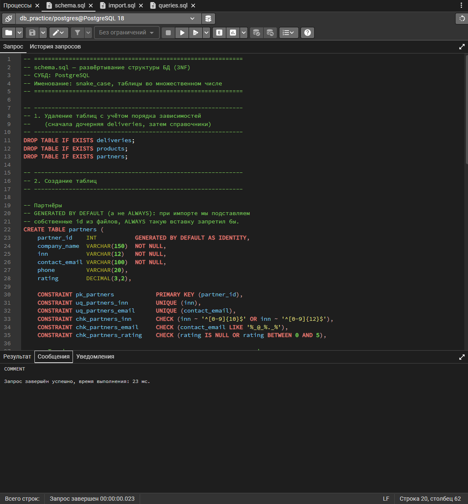
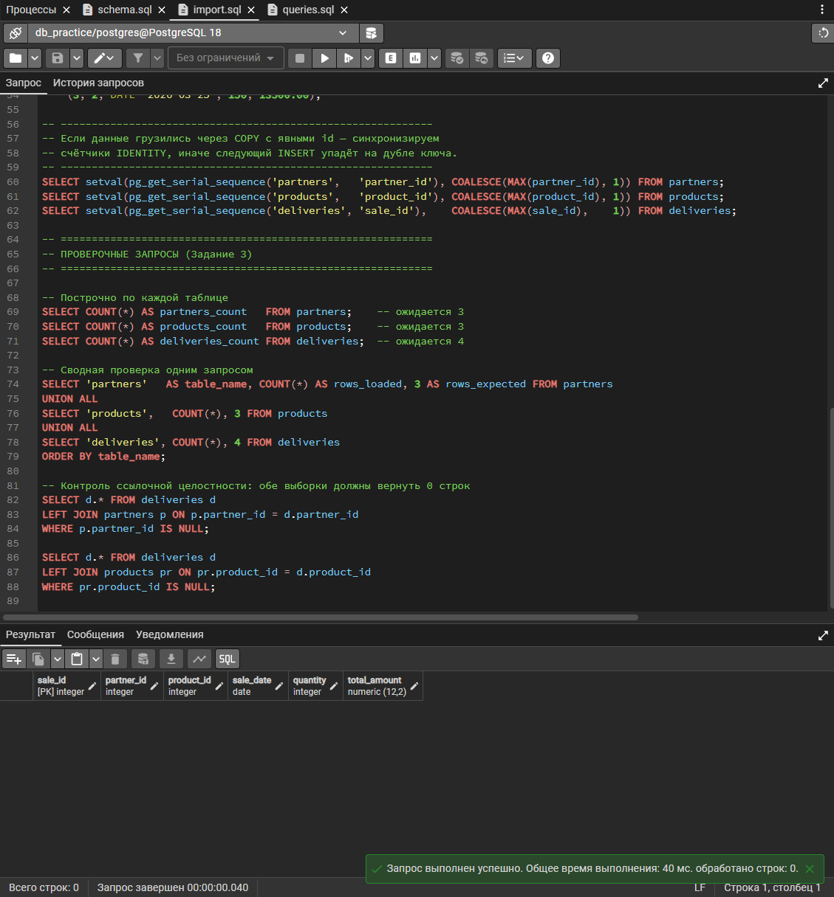
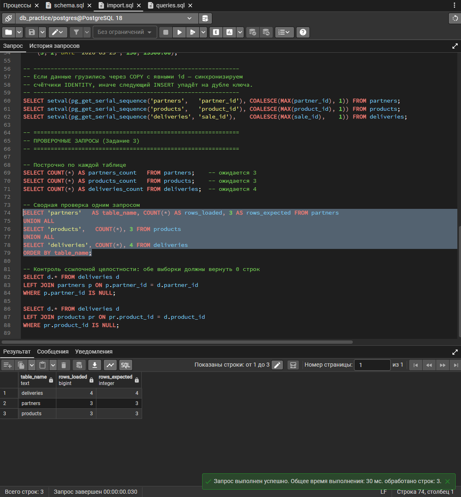
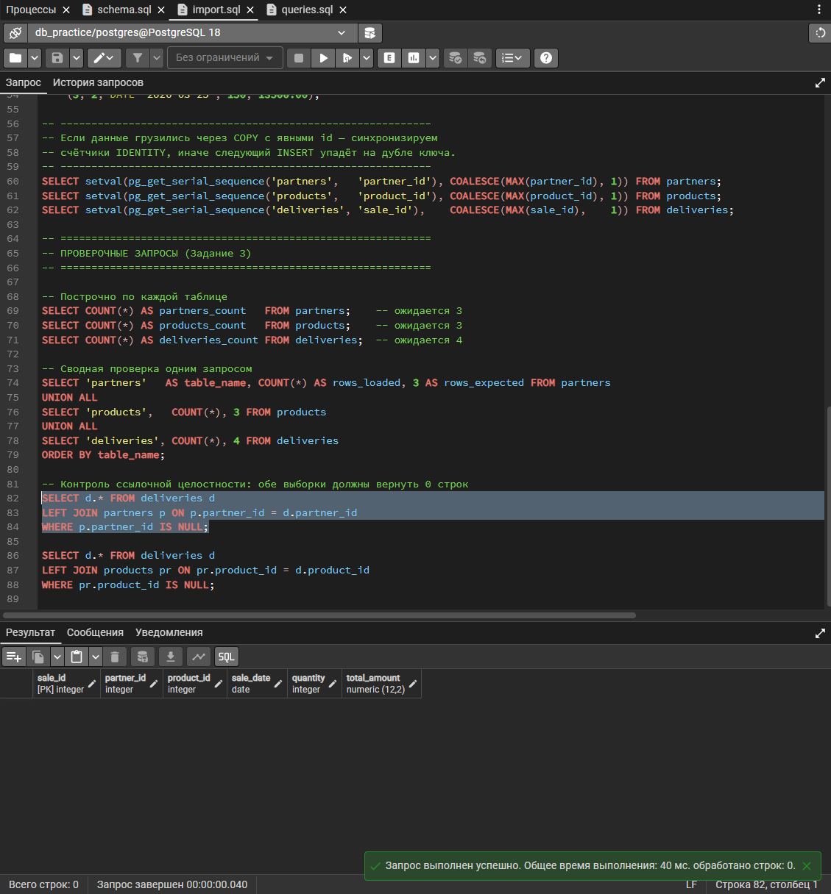
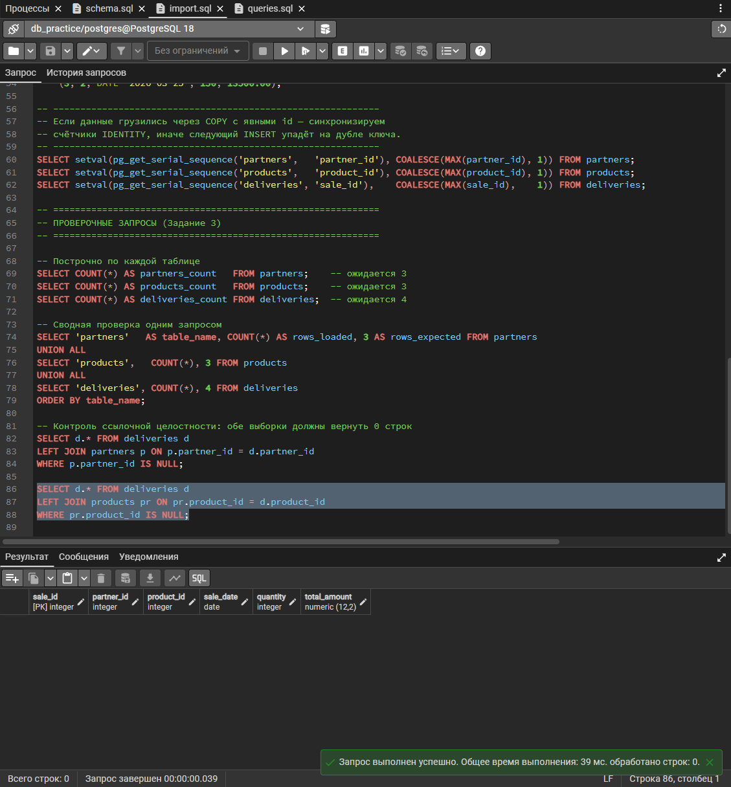
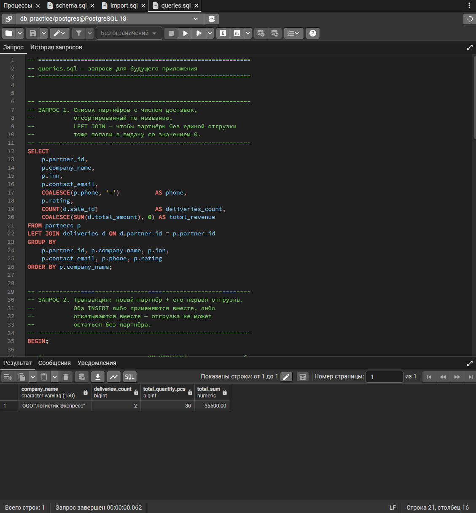

# Проектирование БД (3NF) — партнёры и история отгрузок

СУБД: PostgreSQL. Именование: `snake_case`, таблицы во множественном числе, единый стиль во всех объектах.

## Состав

Каждому заданию — своя папка. Всё, что нужно по заданию, лежит в ней
целиком, отдельно искать нечего.

| Папка и файл | Назначение |
|---|---|
| **`task-1-erd/`** | **Задание 1 — проектирование 3NF** |
| `task-1-erd/erd.pdf` | ER-диаграмма |
| **`task-2-schema/`** | **Задание 2 — DDL** |
| `task-2-schema/schema.sql` | DROP + CREATE + ограничения |
| `task-2-schema/screenshots/` | Снимок успешного развёртывания |
| **`task-3-etl/`** | **Задание 3 — очистка и импорт** |
| `task-3-etl/raw/import_partners.csv` | Исходник как выдан, без правок |
| `task-3-etl/raw/import_sales.txt` | Исходник как выдан, без правок |
| `task-3-etl/partners_clean.csv` | Очищенные партнёры |
| `task-3-etl/products_clean.csv` | Справочник продукции, выделен при нормализации |
| `task-3-etl/deliveries_clean.csv` | Очищенная история отгрузок |
| `task-3-etl/import.sql` | Импорт + проверочные `SELECT COUNT(*)` |
| `task-3-etl/screenshots/` | Снимки выполнения и контроля целостности |
| **`task-4-queries/`** | **Задание 4 — бизнес-запросы** |
| `task-4-queries/queries.sql` | Три запроса |
| `task-4-queries/screenshots/` | Снимок результата |

Порядок запуска сквозной, папки его не меняют:
`task-2-schema/schema.sql` → `task-3-etl/import.sql` → `task-4-queries/queries.sql`.
Вариант с `\copy` запускать из `task-3-etl/` — CSV лежат там же, рядом со скриптом.

Исходники лежат в `task-3-etl/raw/` намеренно и нетронутыми — вплоть до CRLF и
табуляций. Очистку без них пришлось бы принимать на слово: рядом с очищенными
файлами любой может сам сверить каждую строку таблицы аномалий ниже с тем, что
было в исходнике.

Всё проверено прогоном на PostgreSQL 18.4: `schema.sql` → загрузка →
`queries.sql`. Обе ветки импорта (`\copy` из CSV и прямые `INSERT`) разворачивают
базу с нуля без ошибок, `queries.sql` выдерживает повторные запуски.

---

## Задание 1. Схема в 3NF

### Сущности

**`partners`** — контрагенты. `partner_id` PK. `company_name` NOT NULL. `inn` и `contact_email` — NOT NULL + UNIQUE: ИНН уникален по закону, email служит логином и не должен повторяться. `phone` и `rating` допускают NULL — в исходных данных они заполнены не у всех, и это законное «значение неизвестно», а не ошибка.

**`products`** — справочник продукции. `product_id` PK, `product_name` NOT NULL + UNIQUE.

**`deliveries`** — история отгрузок. `sale_id` PK, `partner_id` и `product_id` — NOT NULL FK, `sale_date` DATE, `quantity` INT, `total_amount` DECIMAL(12,2).

### Почему это 3NF

- **1NF** — все атрибуты атомарны, повторяющихся групп нет. Дата приведена к единому типу `DATE`, а не к строке.
- **2NF** — ключи `partner_id`, `product_id`, `sale_id` простые, частичных зависимостей от части составного ключа возникнуть не может.
- **3NF** — ключевой шаг: в исходном файле `import_sales.txt` название товара лежало прямо в строке отгрузки и повторялось у разных записей. Это транзитивная зависимость — название определяется товаром, а не фактом отгрузки. Поэтому оно вынесено в `products`, а в `deliveries` осталась ссылка `product_id`. Теперь переименование товара — это правка одной строки справочника, а не поиск по всей истории.

`total_amount` намеренно хранится, а не вычисляется: это фактическая сумма документа, она может отличаться от `quantity × цена` из-за скидок, и переписывать историю при изменении прайса нельзя.

### Поведение при удалении

Для обоих FK выбран `ON DELETE RESTRICT`: партнёра или товар нельзя удалить, пока на них ссылается история отгрузок. `CASCADE` здесь был бы опасен — удаление одного партнёра молча стёрло бы бухгалтерскую историю. `ON UPDATE CASCADE` оставлен на случай перенумерации справочников.

---

## Задание 2. `schema.sql`

Скрипт содержит:

1. `DROP TABLE IF EXISTS` в порядке зависимостей — сначала дочерняя `deliveries`, затем `products` и `partners`.
2. `CREATE TABLE` с типами: `VARCHAR` для текста, `INT` для количеств и ключей, `DATE` для даты отгрузки, `DECIMAL(12,2)` для сумм и `DECIMAL(3,2)` для рейтинга. Деньги — только `DECIMAL`: `FLOAT` даёт ошибки округления и для расчётов непригоден.
3. Ограничения вынесены в именованные `CONSTRAINT` (`pk_`, `uq_`, `fk_`, `chk_`) — так ошибка от СУБД называет конкретное правило, а не автоимя вида `partners_inn_key`.

Дополнительно заданы `CHECK`: формат ИНН (10 или 12 цифр), правдоподобие email, канонический формат телефона, `rating` в диапазоне 0–5, `quantity > 0`, `total_amount >= 0`.

Идентификаторы объявлены как `GENERATED BY DEFAULT AS IDENTITY`, а не `ALWAYS`. При импорте мы подставляем собственные `id` из файлов — `ALWAYS` такую вставку запретил бы.

### Развёртывание

Скрипт выполнен в pgAdmin 4 на PostgreSQL 18 в отдельной базе `db_practice`
(отдельной намеренно: файл начинается с `DROP TABLE IF EXISTS`, и запускать его
в рабочей базе нельзя).

---

## Задание 3. Очистка и импорт

### Найденные аномалии

| Файл | Строка | Аномалия | Решение |
|---|---|---|---|
| `import_partners.csv` | 1, 3 | Ведущие и хвостовые пробелы в `company_name` (`' ООО "Логистик-Экспресс" '`, `'  ТК "Быстрый Путь"  '`) | `TRIM` |
| `import_partners.csv` | 2 | Пустой `phone` | `NULL` (атрибут необязателен) |
| `import_partners.csv` | 1, 3 | Разнобой в формате `phone`: `'+7 (999) 111-22-33'` против `'+78125554433'` | Приведено к одному виду `+7XXXXXXXXXX` |
| `import_partners.csv` | 3 | Пустой `rating` | `NULL`, **не 0** — ноль означал бы худшую оценку, а партнёр просто не оценён |
| `import_sales.txt` | 102 | Дата `15.03.2026` в формате DD.MM.YYYY, остальные в ISO | Приведено к `2026-03-15` |
| `import_sales.txt` | 104 | `partner_id = 4`, такого партнёра нет — нарушение ссылочной целостности | Строка исключена из импорта |
| `import_sales.txt` | все | `product_name` дублируется в записях отгрузок | Вынесено в справочник `products` (3NF) |

Полных дубликатов строк ни в одном файле не оказалось. Повторов по `inn`,
`contact_email` и `sale_id` тоже нет — проверено по исходникам из `task-3-etl/raw/`.

**По формату телефона отдельно.** Два номера записаны по-разному, и ни один из
них не «неправильный» — неправильно, что они разные. По таким значениям не
работает ни сравнение, ни поиск: один и тот же номер в двух написаниях база
считает двумя разными. Поэтому в `phone` хранится канон — плюс и только цифры,
а скобки и дефисы оставлены интерфейсу, это дело отображения, а не хранения.
Решение закреплено ограничением `chk_partners_phone`, иначе следующий же
`INSERT` вернул бы разнобой.

**По строке 104 отдельно.** Это «сирота» — отгрузка на несуществующего партнёра. Загрузить её невозможно: FK её отклонит. Вариантов два — либо завести партнёра-заглушку, либо исключить запись. Выбрано исключение: выдумывать контрагента с неизвестным ИНН и email нельзя, а `NULL` в `partner_id` разрушил бы смысл истории отгрузок. В реальном проекте такую строку возвращают заказчику на уточнение.

### Итог загрузки

| Таблица | Строк |
|---|---|
| `partners` | 3 |
| `products` | 3 |
| `deliveries` | 4 (из 5 исходных) |

### Импорт

В `import.sql` три варианта на выбор: серверный `COPY`, клиентский `\copy` из psql и прямые `INSERT`. Те же три CSV годятся и для графического мастера — `Import/Export Data` в pgAdmin, мастер импорта в DBeaver. После загрузки с явными `id` вызывается `setval`: счётчики `IDENTITY` о подставленных значениях не знают, и следующий `INSERT` упал бы на дубликате ключа.

Вариант с `\copy` работает только в psql: это мета-команда клиента, и Query Tool
в pgAdmin её не понимает. Отсюда прогон выполнен вариантом с прямыми `INSERT` —
он развернул базу целиком.

### Проверка

`SELECT COUNT(*)` по каждой таблице плюс сводный запрос `UNION ALL`, сравнивающий фактическое число строк с ожидаемым. Отдельно — два запроса на «сирот» через `LEFT JOIN ... WHERE ... IS NULL`; оба обязаны вернуть пустой результат.

Фактическое число строк совпало с ожидаемым по всем трём таблицам: `partners` 3,
`products` 3, `deliveries` 4 из 5 исходных.

Контроль ссылочной целостности по обоим внешним ключам — обе выборки вернули
ноль строк, то есть отгрузок на несуществующего партнёра или товар в базе нет.
Исключённая строка 104 отсеяна осознанно, а не потерялась при загрузке.

---

## Задание 4. `queries.sql`

**Запрос 1 — список партнёров с числом доставок.** `LEFT JOIN` вместо `INNER JOIN` принципиален: партнёр без единой отгрузки обязан попасть в список со счётчиком `0`, а `INNER JOIN` его бы отбросил. `COUNT(d.sale_id)` считает по столбцу дочерней таблицы, а не `COUNT(*)` — иначе у партнёра без отгрузок вышла бы единица. Сортировка по `company_name`. Дополнительно выводится сумма выручки.

**Запрос 2 — транзакция.** Партнёр и его первая отгрузка в одном блоке `BEGIN ... COMMIT`: при ошибке на втором шаге откатывается и первый, отгрузка не может остаться без партнёра. Идентификатор не хардкодится — CTE с `INSERT ... RETURNING partner_id` передаёт его сразу во вставку в `deliveries`. Товар добавляется с `ON CONFLICT (product_name) DO NOTHING`. В тот же блок включён `UPDATE` существующего партнёра — демонстрация редактирования данных.

Вставка партнёра идёт через `ON CONFLICT (inn) DO UPDATE`, и это не
перестраховка. `inn` уникален, поэтому при втором запуске файла простой
`INSERT` падал бы с `duplicate key value violates unique constraint
"uq_partners_inn"` — а так как блок один на всю транзакцию, вместе с ним
откатывался бы и `UPDATE`, и до запроса 3 дело уже не доходило бы.
`DO NOTHING` здесь тоже не годится: при конфликте `RETURNING` не вернул бы ни
одной строки, внешний `INSERT` получил бы пустой CTE, отгрузка молча не
вставилась бы — и никакой ошибки, по которой это можно заметить. `DO UPDATE`
отдаёт `partner_id` в любом случае и заодно обновляет карточку, то есть прямо
отрабатывает «добавление **или** обновление» из условия.

Сама отгрузка защищена условием `NOT EXISTS` по этому партнёру: «первая»
означает, что вставлять её нужно, только если ни одной ещё нет. У `deliveries`
естественного уникального ключа нет, опереться на `ON CONFLICT` не на что, и
без этой проверки каждый повторный прогон плодил бы копии тестовой записи.
Итог: файл можно запускать сколько угодно раз, состояние базы после первого
прогона не меняется — проверено тремя запусками подряд.

**Запрос 3 — история отгрузок.** Детализация по конкретному партнёру за период: название товара, дата, объём в штуках, сумма и расчётная цена за единицу. Фильтр по `partner_id` и `BETWEEN` по дате — значения в скрипте помечены как параметры (`:partner_id`, `:date_from`, `:date_to`), приложение подставит свои. Следом идёт итоговый агрегат: количество отгрузок, суммарный объём и общая сумма за период.

### Результат

Файл выполнен целиком. На снимке — итоговый агрегат по партнёру 1 за март:
2 отгрузки, 80 штук, 35 500.00. То, что он вообще отрисовался, означает, что
транзакция из запроса 2 дошла до `COMMIT` без отката: pgAdmin показывает
результат только последнего запроса, а до него очередь доходит лишь при
успешном выполнении всех предыдущих.

