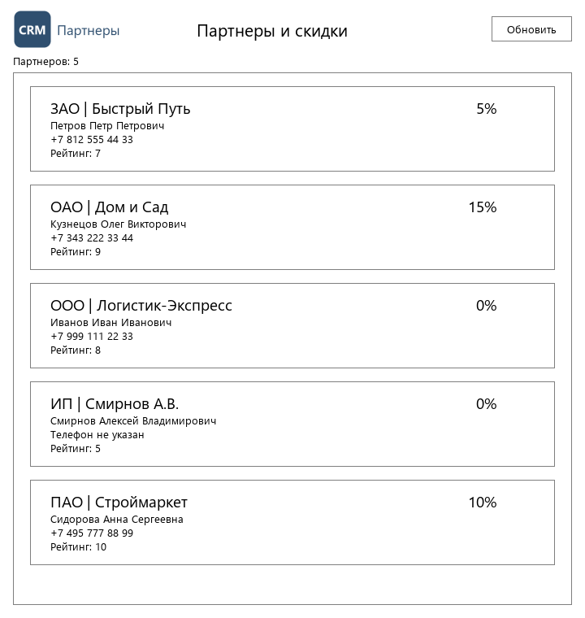
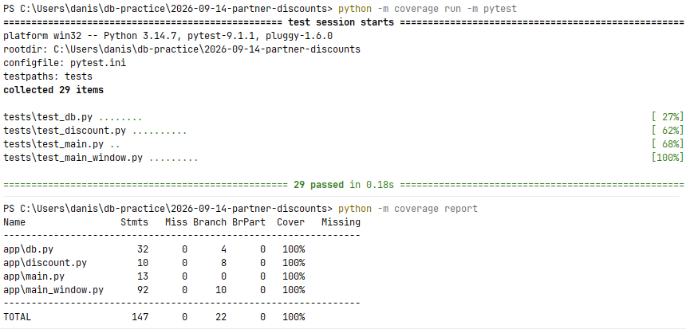

# Скидки партнеров: бизнес-логика, база и интерфейс

Практика 14.09.2026. Python 3.14, PySide6, PostgreSQL, psycopg 3.

## Состав

| Задание | Файлы |
|---|---|
| 1. Расчет скидки | `app/discount.py`, `tests/test_discount.py`, `screenshots/coverage.png` |
| 2. Интеграция с БД | `sql/schema.sql`, `sql/seed.sql`, `app/db.py`, `tests/test_db.py` |
| 3. Интерфейс | `app/main_window.py`, `app/resources/`, `screenshots/app-window.png` |
| 4. Наполнение и отладка | `app/main.py`, `tests/test_main_window.py`, `tests/test_main.py` |

Код лежит одной программой в `app/`.

## Запуск

Зависимости:

```
pip install -r requirements.txt
```

База: создать `partner_discounts` и выполнить по очереди `sql/schema.sql` и
`sql/seed.sql` (в pgAdmin: Query Tool, `F5`). Оба скрипта переживают повторный
запуск: `seed.sql` перезаливает тестовые данные целиком.

Подключение берется из переменных окружения `PGHOST`, `PGPORT`, `PGUSER`,
`PGDATABASE`, `PGPASSWORD`. По умолчанию `localhost:5432`, пользователь
`postgres`, база `partner_discounts`. Пароль в коде не хранится, только в
`PGPASSWORD`. Из папки практики в PowerShell:

```
$env:PGPASSWORD = "пароль"
python app/main.py
```

Тесты с замером покрытия:

```
python -m coverage run -m pytest
python -m coverage report
```

Если база недоступна, тесты задания 2 и сквозные пропускаются, остальные
идут как обычно.

---

## Задание 1. Расчет скидки

`calculate_partner_discount(total_quantity) -> int` в `app/discount.py`. Границы
лежат в таблице `DISCOUNT_TIERS` по убыванию: первая, до которой объем
дотянулся, и дает скидку. Так все числа из ТЗ стоят в одном месте, а не
разбросаны по условиям.

Два случая сверх ТЗ: `None` (у партнера нет продаж, `SUM` дает `NULL`) считается
как нулевой объем и дает 0%, а отрицательный объем отклоняется `ValueError`:
продажа в минус - это ошибка данных, а не повод для скидки.

Тесты проверяют все границы из ТЗ с обеих сторон: `9999`, `10000`, `49999`,
`50000`, `299999`, `300000`, плюс `0`, `1000000`, `None` и `-1`. Покрытие
`discount.py` - 100% и по строкам, и по ветвлениям (снимок прогона - в
задании 4).

## Задание 2. Интеграция с БД

Схема: `partner_types`, `partners`, `products`, `sales_history`. Тип партнера
вынесен в справочник, телефон хранится каноном (`+` и цифры), рейтинг от 0 до 10,
как в макете.

Функции `app/db.py`:

- `fetch_partner_total_quantity(connection, partner_id)` - `SUM(quantity)` по
  `sales_history` через `LEFT JOIN` для одного партнера;
- `fetch_partner_with_discount(connection, partner_id)` - объект `Partner` с
  данными партнера и его скидкой;
- `fetch_partners_with_discounts(connection)` - все партнеры одним запросом,
  для окна.

`LEFT JOIN` идет от `partners`, а не от `sales_history`: у партнера без продаж
строка все равно возвращается, только с `NULL` в сумме. Так «партнера нет»
(строк нет, `LookupError`) отличается от «продаж нет» (`None`, скидка 0%).

Тестовые объемы в `seed.sql` подобраны точно на границы скидок:

| Партнер | Объем | Скидка |
|---|---|---|
| Логистик-Экспресс | 9 999 | 0% |
| Быстрый Путь | 10 000 | 5% |
| Строймаркет | 50 000 | 10% |
| Дом и Сад | 300 000 | 15% |
| Смирнов А.В. | продаж нет | 0% |

## Задание 3. Интерфейс

Заголовок окна «CRM: Список партнеров и скидок», иконка и логотип из
`app/resources/`, шапка с логотипом, заголовком и кнопкой «Обновить», ниже
список карточек по `Screenshot_2`: шрифт Segoe UI, белый фон, серые рамки
в 1 px у списка и у каждой карточки. В карточке крупно «Тип | Наименование» и
скидка справа, ниже директор, телефон группами (`+7 999 111 22 33`) и рейтинг.

Логотип и иконка пока временные. Настоящие кладутся поверх `logo.png` и
`icon.png` с теми же именами, код менять не нужно.



Снимок запущенного приложения на базе `partner_discounts`: в заголовке окна
название и иконка, в списке все пять партнеров со скидками.

## Задание 4. Наполнение, отладка и проверка

Окно при запуске читает партнеров из базы и показывает у каждого
рассчитанную скидку.

- **Нет продаж.** `SUM(quantity)` дает `NULL`, в Python приходит `None`,
  функция расчета возвращает 0%. Проверено на партнере «Смирнов А.В.» в базе и
  отдельным тестом окна.
- **Ошибка базы.** Окно не падает: список очищается, в строке состояния
  «Не удалось загрузить партнеров», в сообщении текст ошибки.
- **Итог прогона:** 29 тестов, покрытие всего `app/` - 100%.


