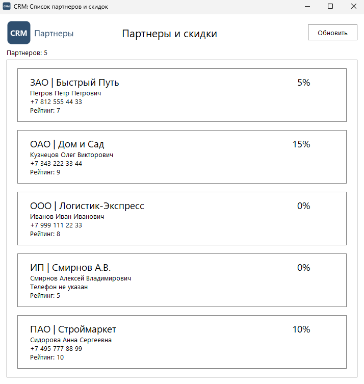

# Задание 3. Разработка интерфейса

| Файл | Назначение |
|---|---|
| `main_window.py` | главное окно и карточка партнера |
| `resources/` | иконка приложения и логотип |
| `screenshots/app-window.png` | снимок запущенного приложения |

## Решение

Окно на PySide6. Заголовок «CRM: Список партнеров и скидок», иконка окна из
`resources/icon.png`, в шапке логотип из `resources/logo.png`, заголовок
страницы и кнопка «Обновить». Ниже список карточек партнеров.

Оформление по макету `Screenshot_2`: шрифт Segoe UI, белый фон, черный текст,
тонкие серые рамки в 1 px у списка и у каждой карточки. В карточке крупно
«Тип | Наименование партнера» и скидка справа, ниже мелким шрифтом директор,
телефон и рейтинг. Телефон разбивается на группы при выводе
(`+7 999 111 22 33`), а в базе хранится каноном.

Раскладка собрана компоновщиками, без ручных координат: окно тянется, карточки
занимают всю ширину, длинный список прокручивается.

Логотип и иконка пока временные. Настоящие кладутся поверх `logo.png` и
`icon.png` с теми же именами, код менять не нужно.
