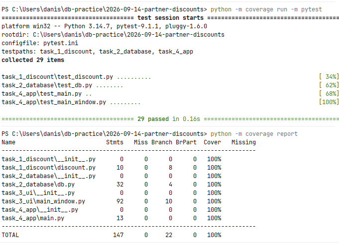

# Задание 4. Наполнение интерфейса, отладка и проверка

| Файл | Назначение |
|---|---|
| `main.py` | точка входа: окно с данными из базы |
| `test_main_window.py` | тесты окна и отказоустойчивости |
| `test_main.py` | сквозная проверка: база -> скидки -> окно |
| `screenshots/coverage.png` | снимок прогона тестов с покрытием |

## Запуск

Из папки практики, база должна быть развернута по
[заданию 2](<../Интеграция с БД и агрегация данных (SQL + Backend)>):

```
$env:PGPASSWORD = "пароль"
python "Наполнение интерфейса, отладка и стресс-тестирование/main.py"
```

Окно читает партнеров из базы и показывает у каждого рассчитанную скидку.

## Отладка

- **Нет истории продаж.** `SUM(quantity)` дает `NULL`, в Python приходит `None`,
  функция расчета возвращает 0%. Проверено на партнере «Смирнов А.В.» в базе и
  отдельным тестом окна.
- **Ошибка базы.** Окно не падает: список очищается, в строке состояния
  «Не удалось загрузить партнеров», в диалоге текст ошибки. Проверено тестом,
  который подсовывает источник данных с ошибкой подключения.
- **Повторное обновление.** Кнопка «Обновить» заменяет карточки, а не
  добавляет новые поверх старых. Проверено тестом.

## Итог прогона

29 тестов, покрытие всех модулей практики - 100%.

```
python -m coverage run -m pytest
python -m coverage report
```


