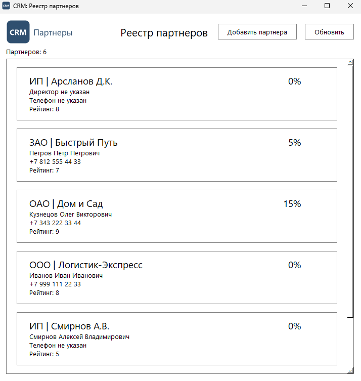

# Задание 3. Интеграция формы с БД (CRUD-операции и обновление UI)

| Файл | Назначение |
|---|---|
| `schema.sql` | DROP + CREATE таблиц и ограничений |
| `seed.sql` | тестовые данные, перезаливаются целиком |
| `db.py` | запросы и операции для окон |
| `discount.py` | расчет скидки для реестра из практики 14.09 |
| `test_db.py`, `test_discount.py` | тесты запросов и скидки |

## Режимы карточки

- **Добавление.** «Добавить партнера» открывает пустую карточку. «Сохранить»
  выполняет `INSERT`, карточка закрывается, реестр перечитывается из базы.
- **Редактирование.** Двойной щелчок по партнеру открывает карточку, в которую
  подгружаются его текущие данные из базы. «Сохранить» выполняет `UPDATE`.

Данные для карточки читаются из базы заново при каждом открытии, а не берутся
из реестра: так в форме всегда актуальная версия.

Реестр сразу после добавления нового партнера: список перечитан из базы сам,
партнеров стало шесть, новый стоит на своем месте по алфавиту.

## Ссылочная целостность в коде приложения

- Тип партнера выбирается только из списка, заполненного из справочника.
- Перед `INSERT` и `UPDATE` приложение проверяет, что выбранный тип есть в
  справочнике. Если его удалили, пользователь получает понятное сообщение, а не
  отказ внешнего ключа от СУБД.
- `UPDATE`, не нашедший строку, означает, что партнера удалили, пока карточка
  была открыта. Это не проходит молча: пользователь получает сообщение.
- Повтор email ловится по нарушению уникальности и объясняется пользователю.
- Каждая операция выполняется в своей транзакции: при ошибке изменения
  откатываются целиком.

## Схема

`partner_types`, `partners`, `products`, `sales_history`. По ТЗ обязательны
только наименование и email, остальные поля карточки могут быть пустыми.
Ограничения дублируют проверки формы: `CHECK` на email, телефон и рейтинг от 0,
`UNIQUE` на email.

Тестовые данные - те же пять партнеров, что в практике 14.09, с адресами и
email. Объемы продаж подобраны на границы скидок.

## Как развернуть

Создать базу `partners_crm` и выполнить `schema.sql`, затем `seed.sql`
(в pgAdmin: Query Tool, `F5`). Подключение берется из `PGHOST`, `PGPORT`,
`PGUSER`, `PGDATABASE` и `PGPASSWORD`.

Тесты с базой работают внутри транзакции, которая откатывается после каждого
теста: добавленные и измененные партнеры в базе не остаются.
