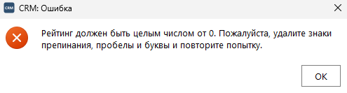
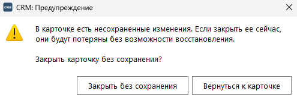
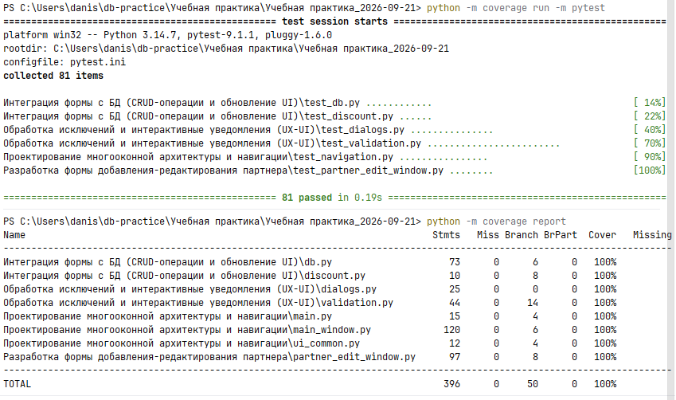

# Задание 4. Обработка исключений и интерактивные уведомления (UX/UI)

| Файл | Назначение |
|---|---|
| `validation.py` | проверка полей карточки до отправки в базу |
| `dialogs.py` | диалоговые окна трех типов |
| `test_validation.py` | тесты проверок |
| `test_dialogs.py` | тесты диалогов и реакции карточки на ошибки |

## Проверка перед сохранением

Сохранение обернуто в `try...except`: ошибка проверки или базы прерывает
операцию, и пользователь видит, что исправить. Поля проверяются сверху вниз,
как на экране, так что первой показывается первая по порядку ошибка.

| Поле | Проверка |
|---|---|
| Наименование | не пустое |
| Тип партнера | выбран из списка |
| Рейтинг | целое число, не меньше 0 |
| Телефон | пусто или 11 цифр, начиная с +7 или 8 |
| Email | не пустой и вида name@company.ru |

## Диалоги

| Тип | Заголовок | Пиктограмма | Когда |
|---|---|---|---|
| Ошибка | CRM: Ошибка | крестик | данные не прошли проверку, СУБД недоступна или отклонила запрос |
| Предупреждение | CRM: Предупреждение | восклицательный знак | «Назад», Esc или крестик окна при несохраненных изменениях |
| Информация | CRM: Информация | «i» | партнер добавлен или изменения сохранены |

Каждое сообщение об ошибке говорит, что не так и как исправить. Например:
«Рейтинг должен быть целым числом от 0. Пожалуйста, удалите знаки препинания,
пробелы и буквы и повторите попытку.» При недоступной базе сообщение советует
проверить, что сервер запущен и пароль в `PGPASSWORD` верный.

В предупреждении кнопки подписаны по-русски: «Закрыть без сохранения» и
«Вернуться к карточке». По умолчанию выбрана вторая, чтобы случайный Enter не
уничтожил введенные данные.

Ошибка: рейтинг `4.5` не прошел проверку, сохранение прервано.

Предупреждение: «Назад» после изменения полей.

## Проверка

81 тест, покрытие всех модулей практики - 100%.

