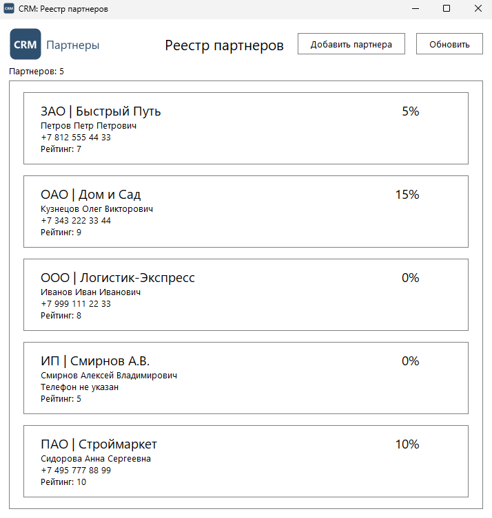

# Задание 1. Проектирование многооконной архитектуры и навигации

| Файл | Назначение |
|---|---|
| `main_window.py` | `MainWindow`: реестр партнеров и переходы в карточку |
| `main.py` | точка входа приложения |
| `ui_common.py` | общее для обоих окон: оформление, иконка, логотип |
| `resources/` | иконка приложения и логотип |
| `test_navigation.py` | тесты переходов |

## Два окна

- `MainWindow` - главная форма, реестр партнеров. Заголовок «CRM: Реестр партнеров».
- `PartnerEditWindow` - карточка партнера из [задания 2](<../Разработка формы добавления-редактирования партнера>).
  Заголовок зависит от режима: «CRM: Карточка партнера [Добавление]» или
  «CRM: Карточка партнера [Редактирование]».

## Переходы

- Кнопка «Добавить партнера» на главной форме открывает пустую карточку.
- Двойной щелчок по партнеру в реестре открывает его карточку с данными из базы.
- Кнопка «Назад» в карточке закрывает ее и возвращает на главную форму.
  Туда же ведут клавиша Esc и крестик окна.

Карточка открывается модально поверх главной формы: пока она открыта, реестр
ждет, а его список и прокрутка остаются как были. После сохранения реестр
перечитывается из базы, и изменения видны сразу.

Главная форма хранит ссылку на открытую карточку, иначе окно удалил бы сборщик
мусора. Партнер в реестре сообщает о двойном щелчке сигналом, а не вызовом
метода формы: так окна не держат друг друга, и PySide6 не падает при их
удалении.

## Сбои

Недоступная база не роняет приложение. При загрузке реестра, открытии карточки
и чтении справочника типов пользователь получает сообщение с порядком действий
(подробнее в [задании 4](<../Обработка исключений и интерактивные уведомления (UX-UI)>)).

## Снимок

Главная форма с уникальным заголовком «CRM: Реестр партнеров» и кнопкой
«Добавить партнера». Карточки партнеров из [задания 2](<../Разработка формы добавления-редактирования партнера>)
открываются из нее двойным щелчком.

