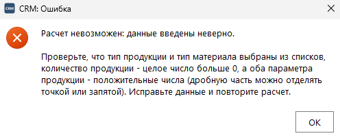

# Задание 3. Интеграция метода расчета и комплексное тестирование

| Файл | Назначение |
|---|---|
| `material_calculator_window.py` | окно «CRM: Расчет материалов» |
| `dialogs.py` | диалоги ошибки, предупреждения и информации |
| `test_material_calculator_window.py` | тесты окна расчета |
| `test_code_style.py` | проверка кода на правила из ТЗ |
| `test_dialogs.py` | тесты диалогов |

## Окно расчета

Открывается кнопкой «Расчет материалов» в реестре. Тип продукции и тип
материала выбираются из списков, заполненных из базы, рядом с названием виден
коэффициент или процент брака. Количество и два параметра вводятся текстом,
дробную часть можно отделять точкой или запятой. Результат метода выводится
на форме: «Необходимо материала: 4 505 ед.».

## Обработка -1

Окно не решает само, годятся ли данные: неразобранное поле уходит в метод
расчета как `None`, и окно читает только его ответ. Если метод вернул `-1`,
форма пишет «Расчет невозможен» и показывает диалог ошибки с порядком
действий: что проверить и в каком виде вводить. Приложение не падает ни на
отрицательном параметре, ни на нулевом количестве, ни на тексте вместо числа,
ни на пустом справочнике типов. Каждый из этих случаев проверен тестом.

## Правила кода из ТЗ

Проверяются автоматически по дереву разбора каждого модуля практики
(`test_code_style.py`), а не на глаз:

- **не более одной команды на строку**: два оператора, начинающихся на одной
  строке (`a = 1; b = 2` или `if x: return`), считаются нарушением;
- **именование**: функции, переменные и аргументы в `snake_case`, константы
  заглавными, классы в `CamelCase`. Исключение - переопределяемые методы Qt
  (`mousePressEvent`), их имена задает библиотека.

Комментарии в коде стоят только там, где логика неочевидна: почему расчет в
`Decimal`, почему `bool` не считается количеством, почему неразобранное поле
передается в метод как `None`.
