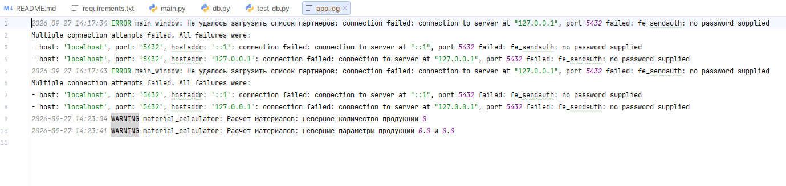

# Задание 4. Модульное тестирование (Unit Testing) и аудит безопасности

| Файл | Назначение |
|---|---|
| `test_material_calculator.py` | модульные тесты метода расчета материалов |
| `test_sql_injection.py` | аудит защиты от SQL-инъекций |
| `app_logging.py` | журнал ошибок в файл `app.log` |
| `test_app_logging.py` | тесты журнала |

## Модульные тесты

Модуль на pytest, справочники в нем - словари-заглушки вместо базы.

| Тест из ТЗ | Функция | Что проверяет |
|---|---|---|
| 1. Стандартный | `test_standard_calculation` | известный результат: 142 |
| 2. Округление | `test_fraction_rounds_up` | 6,057 округляется вверх до 7 |
| 3. Несуществующий тип | `test_unknown_type` | -1 для чужих id продукции и материала |
| 4. Отрицательные параметры | `test_negative_params` | -1 при отрицательном `param_1` или `param_2` |
| 5. Нулевое количество | `test_zero_or_negative_quantity` | -1 при количестве 0 и меньше |

Сверх ТЗ: целый результат не округляется лишний раз; погрешность `float` не
добавляет единицу материала; ноль, `NaN`, бесконечность и не числа в
параметрах; дробное и логическое количество; справочник со значениями `float`;
запись отказа в журнал.

## Аудит SQL-инъекций

Проверка в два слоя:

- **по коду**: запросы к базе выполняются только в `db.py`, и текст каждого -
  готовая строка-константа модуля. Ни f-строк, ни склеек, ни `format`:
  пользовательскому вводу в тексте SQL взяться неоткуда. Значения передаются
  параметрами `%(имя)s`, и psycopg экранирует их сам;
- **по базе**: наименование `Робертс'); DROP TABLE partners; --` и адрес
  `1' OR '1'='1` сохраняются и читаются как обычный текст, таблица на месте.
  Строка `1 OR 1=1` вместо id партнера отклоняется СУБД как неверное число, а
  не выполняется.

## Журнал ошибок

При каждом перехвате исключения (`try...except`) в `app.log` пишется строка
с датой, временем, уровнем, модулем и понятным текстом:

```
2026-09-28 14:05:12 ERROR main_window: Не удалось загрузить список партнеров: connection refused
2026-09-28 14:06:40 WARNING material_calculator: Расчет материалов: неверное количество продукции 0
```

Пишутся ошибки базы при загрузке реестра, открытии карточки и истории,
сохранении партнера; отклоненные проверкой данные карточки; отказы метода
расчета. Файл создается рядом с приложением и в репозиторий не попадает.

Журнал после запуска без пароля к базе и двух отказов расчета:


