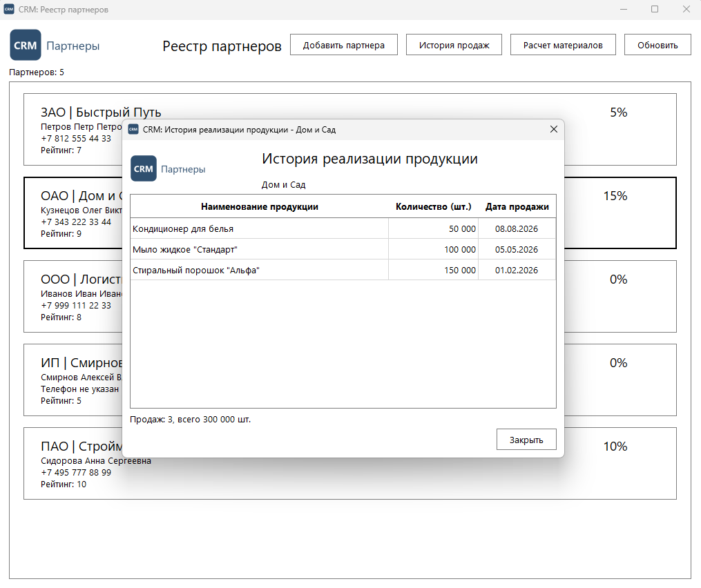

# Задание 1. Разработка интерфейса истории реализации продукции

| Файл | Назначение |
|---|---|
| `partner_history_window.py` | `PartnerHistoryWindow`: история продаж партнера |
| `main_window.py` | реестр партнеров: выбор партнера и кнопка «История продаж» |
| `db.py` | запросы к базе, в том числе история продаж с `JOIN` |
| `schema.sql`, `seed.sql` | структура базы и тестовые данные |
| `main.py` | точка входа приложения |
| `test_partner_history_window.py`, `test_navigation.py`, `test_db.py` | тесты окна, переходов и запросов |

Здесь же лежит основа приложения из практики 21.09: реестр, карточка партнера,
проверка ввода, скидки. Их тесты перенесены вместе с ними.

## Окно истории

- Заголовок «CRM: История реализации продукции - <название партнера>», иконка
  приложения, в шапке логотип.
- Оформление по руководству по стилю: шрифт Segoe UI, белый фон, черный
  текст, тонкие серые рамки.
- Таблица только для чтения: «Наименование продукции», «Количество (шт.)»,
  «Дата продажи». Количество с разрядами (`150 000`), дата в виде `30.07.2026`.
- Под таблицей итог: число продаж и общее количество. Если продаж нет, так и
  написано.

В заголовке окна стоит дефис, а не длинное тире из примера в ТЗ: длинного
тире нет на клавиатуре, и в коде оно не используется.

## Переход с главной формы

Щелчок по партнеру в реестре выделяет его рамкой и включает кнопку «История
продаж», до выбора она неактивна. Кнопка открывает окно истории, в которое
передается `partner_id` выбранного партнера. Двойной щелчок, как и раньше,
открывает карточку партнера.

Выбран «Дом и Сад» (жирная рамка в реестре), поверх открыта его история:



## Запрос

```sql
SELECT pr.product_name, s.quantity, s.sale_date
FROM sales_history AS s
JOIN products AS pr ON pr.product_id = s.product_id
WHERE s.partner_id = %(partner_id)s
ORDER BY s.sale_date DESC, s.sale_id DESC
```

Название продукции берется из справочника `products` через `JOIN`. Новые
продажи идут сверху: менеджеру чаще нужна свежая активность партнера.
`partner_id` передается параметром, а не вставляется в текст запроса.
