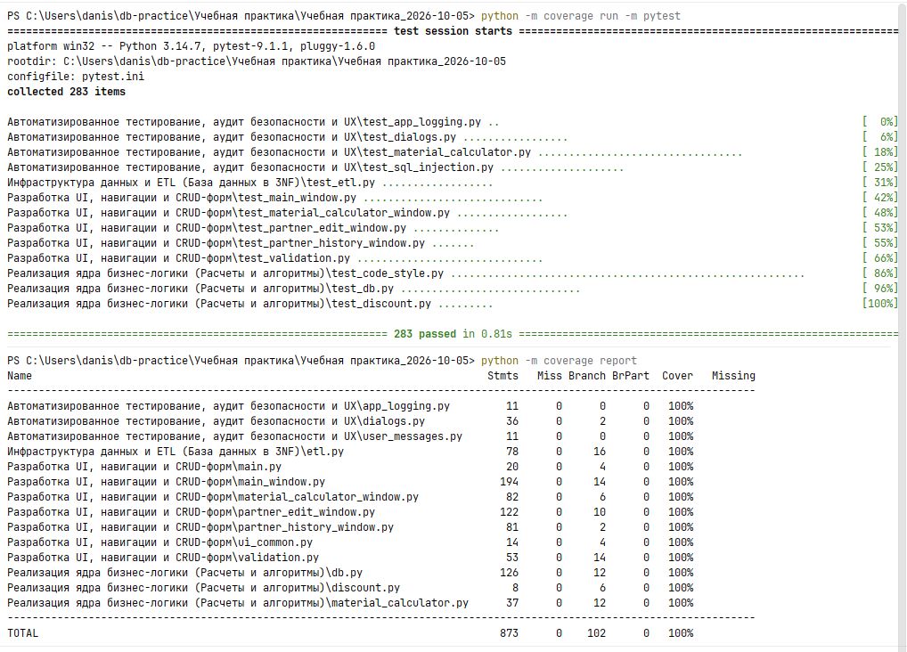
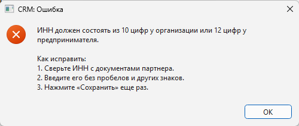
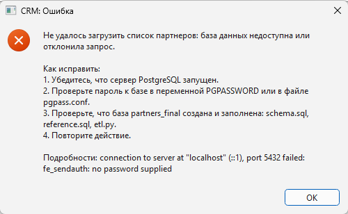
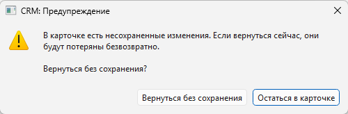

# Задание 4. Автоматизированное тестирование, аудит безопасности и UX

| Файл | Назначение |
|---|---|
| `test_material_calculator.py` | модульные тесты метода расчета сырья |
| `test_sql_injection.py` | аудит SQL-инъекций |
| `dialogs.py` | MessageBox и перехват непредвиденных ошибок |
| `user_messages.py` | тексты ошибок с пошаговым исправлением |
| `app_logging.py` | журнал ошибок `app.log` |
| `test_dialogs.py`, `test_app_logging.py` | тесты сообщений, «Назад» и журнала |

## Прогон

Из папки практики:

```
$env:PGPASSWORD = "пароль"
python -m coverage run -m pytest
python -m coverage report
```

283 теста, покрытие всех модулей 100%. Без базы тесты с базой
пропускаются, остальные идут как обычно.



## Модульные тесты

pytest, справочники - заглушка на словарях вместо базы: тест проверяет сам
расчет и от сервера не зависит. С настоящей базой метод проверяет
`test_db.py` задания 2.

| Тест | Что проверяет |
|---|---|
| 1. `test_standard_calculation` | базовый расчет: 142 |
| 2. `test_fraction_rounds_up` | 6,057 округляется вверх до 7 |
| 3. `test_unknown_type_id` | -1 при несуществующем, нулевом или не числовом id |
| 4. `test_negative_params` | -1 при отрицательных параметрах |
| 5. `test_zero_or_negative_quantity` | -1 при количестве 0 и меньше |
| 6-13 | ровный результат не растет; погрешность `float` не добавляет единицу; ноль, NaN, бесконечность и не числа; дробное количество; на неверном вводе к справочникам не обращаются; справочник на `float`; `Decimal`; запись отказа в журнал |

## Аудит SQL-инъекций

Ни одной склейки SQL в коде нет. Проверка в два слоя:

- **по коду**: запросы выполняются только в `db.py` и `etl.py`. Ни один
  аргумент `execute` и `copy` не собирается f-строкой, `+`, `%`, `format`
  или `join`, и ни одна f-строка в модулях не начинается с SQL. Значения
  передаются параметрами `%(имя)s` и уходят на сервер отдельно от текста
  запроса;
- **по базе**: поиск `' OR '1'='1` ничего не находит, а не отдает всех.
  Наименование `Робертс'); DROP TABLE partners; --`, адрес и ФИО директора
  с SQL сохраняются и читаются как обычный текст. Строка `1 OR 1=1` вместо
  id отклоняется СУБД как неверное число.

В поиске экранируются еще и `%` и `_`: это не инъекция, но без экранирования
поиск «%» находил бы всех.

## Исключения и MessageBox

Каждое обращение к базе в окнах обернуто в `try...except`. Ошибка ввода или
недоступность базы дает MessageBox с иконкой ошибки, описанием и шагами
исправления.





Что не поймано в обработчике окна, перехватывает `sys.excepthook`
(`dialogs.handle_unexpected_error`): ошибка пишется в `app.log` с
трассировкой и показывается сообщением, а приложение продолжает работать.

«Назад», Esc или крестик в карточке с измененными полями спрашивают, точно
ли уходить. По умолчанию выбрана кнопка «Остаться в карточке»: случайный
Enter введенное не уничтожит.



## Комментарии

Комментарии стоят только там, где код сам не объясняет, почему он такой:

- `material_calculator.py` - почему `Decimal`, а не `float`, почему
  округление строго вверх и почему ввод проверяется до запросов;
- `partner_edit_window.py` - передача id партнера между окнами: `None`
  ведет к INSERT, число к UPDATE и загрузке истории;
- `partner_history_window.py` - почему окно открывается через `open()` и
  что от этого «Назад» не теряет контекст;
- `main_window.py` - почему карточка партнера общается с формой сигналами
  (иначе цикл ссылок и падение PySide6), отложенный поиск;
- `etl.sql` - разбор дат, латинские буквы в ФИО, проверка ссылок по
  принятым строкам, сдвиг счетчиков IDENTITY;
- `etl.py` - почему файлы разбирает Python, а не COPY, и как узнается cp1251.

Описание назначения функций - в docstring, а не в комментариях.
