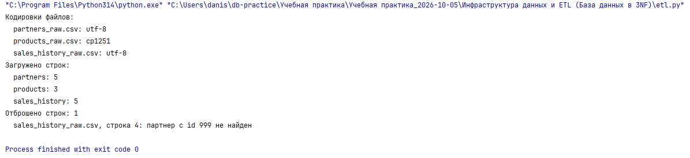
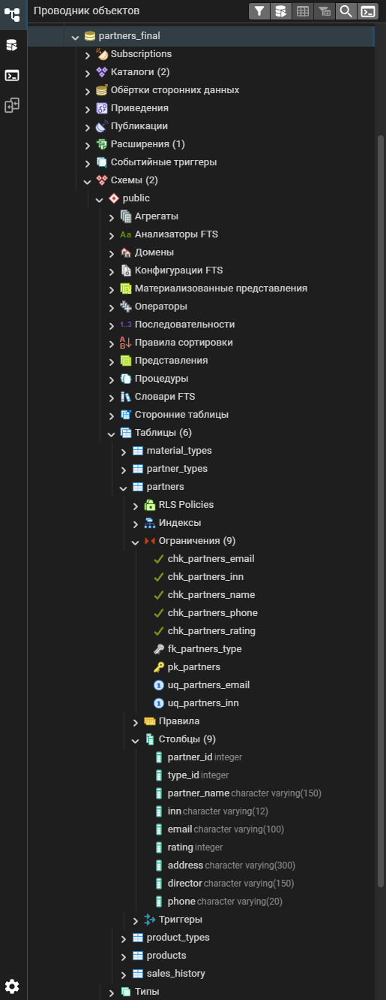
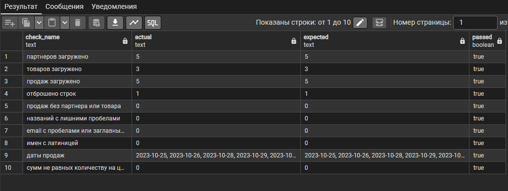

# Задание 1. Инфраструктура данных и ETL (База данных в 3NF)

| Файл | Назначение |
|---|---|
| `raw/` | выгрузки заказчика, байт в байт как получены |
| `schema.sql` | DDL чистого хранилища |
| `reference.sql` | справочники: типы партнеров, типы продукции и материалов |
| `staging.sql` | промежуточные таблицы для сырых строк |
| `etl.py` | импорт файлов в staging и запуск очистки |
| `etl.sql` | очистка, проверка ссылок и перенос в чистые таблицы |
| `checks.sql` | проверка результата одним запросом |
| `test_etl.py` | тесты импорта |

## Порядок запуска

1. Создать базу `partners_final`.
2. Выполнить `schema.sql`, затем `reference.sql` (в pgAdmin - Query Tool).
3. Из папки практики:

```
$env:PGPASSWORD = "пароль"
python "Инфраструктура данных и ETL (База данных в 3NF)/etl.py"
```

4. Выполнить `checks.sql`: в столбце `passed` все строки `true`.

`etl.sql` можно выполнять повторно и в pgAdmin: staging после `etl.py`
остается в базе. Чистые таблицы перезаливаются целиком.

## Схема (3NF)

```
partner_types 1 ──< partners 1 ──< sales_history >── 1 products
product_types, material_types - справочники расчета материалов (задание 2)
```

| Таблица | Ключ | Ограничения |
|---|---|---|
| `partner_types` | `type_id` | `type_name` UNIQUE |
| `partners` | `partner_id` | FK на тип; `inn` и `email` NOT NULL UNIQUE; ИНН из 10 или 12 цифр; рейтинг от 0 |
| `products` | `product_id` | `product_name` UNIQUE; `price DECIMAL(12,2)` больше 0 |
| `sales_history` | `sale_id` | FK на партнера и товар; количество больше 0; `amount DECIMAL(14,2)` |
| `product_types` | `product_type_id` | `coefficient DECIMAL(6,2)` больше 0 |
| `material_types` | `material_type_id` | `defect_percent DECIMAL(5,2)` от 0 до 100 |

Именование - `snake_case`, у ограничений префиксы `pk_`, `fk_`, `uq_`, `chk_`.

Решения по нормализации:

- **Форма партнера вынесена в справочник.** В выгрузке она приклеена к
  названию: `ООО "Вектор"`. Одно и то же «ООО» в каждой строке - повтор, а
  тип партнера нужен в карточке выпадающим списком. ETL отделяет первое
  слово, сверяет его со справочником и хранит `type_id`, а в названии
  остается `Вектор`.
- **Сумма продажи хранится.** Сейчас она равна количеству на цену, но это
  цена на день сделки, а цена в номенклатуре будет меняться. Значит, `amount`
  зависит от продажи, а не от товара, и 3NF не нарушает. Совпадение с
  текущей ценой проверяет `checks.sql`.
- Адреса, директора, телефона и рейтинга в выгрузке нет. Эти поля
  заполняются в карточке партнера, пока адрес, директор и телефон пустые, а
  рейтинг 0.

## Аномалии в выгрузках

| Файл | Аномалия | Как устранена |
|---|---|---|
| `products_raw.csv` | кодировка cp1251, остальные файлы в UTF-8 | `etl.py` пробует UTF-8 и при ошибке читает cp1251 |
| `products_raw.csv`, `partners_raw.csv` | кавычка посреди поля без кавычек: `Монитор 27"`, `АО "Технолоджис"` | файлы разбирает модуль csv, см. ниже |
| `partners_raw.csv` | пробелы по краям названий и email, двойной пробел внутри | `btrim`, серии пробелов сжимаются до одного |
| `partners_raw.csv` | `ИП ...Петров  A.B.`: многоточие и инициалы латиницей | многоточие убирается; у ИП латинские двойники заменяются кириллицей: `Петров А.В.` |
| `partners_raw.csv` | форма и кавычки в названии | форма уходит в `partner_types`, обрамляющие кавычки снимаются |
| `partners_raw.csv` | email с пробелами | `lower(btrim(email))` |
| `sales_history_raw.csv` | даты в пяти форматах и с пробелами | `staging.parse_date` приводит к `DATE` (ГГГГ-ММ-ДД) |
| `sales_history_raw.csv` | продажа 1003 у несуществующего партнера 999 | строка не переносится, причина в `staging.rejected_rows` |
| все | CRLF в конце строк | модуль csv читает их сам |

Даты:

| В файле | В базе |
|---|---|
| `25.10.2023` | 2023-10-25 |
| `2023/10/26` | 2023-10-26 |
| `28-10-2023` | 2023-10-28 |
| `2023.10.29` | 2023-10-29 |
| ` 2023-10-30 ` | 2023-10-30 |

Почему файлы читает Python, а не `COPY ... CSV` или импорт pgAdmin:
PostgreSQL открывает кавычки на любой кавычке в поле. На `products_raw.csv`
он падает с `unterminated CSV quoted field`, а `АО "Технолоджис"` молча
загружает как `АО Технолоджис`. Проверено на PostgreSQL 18.

Сырые строки ложатся в staging текстом, вся очистка - в SQL (`etl.sql`).
Каждая строка либо переносится, либо получает причину отказа: неверное
число, неразборчивая или несуществующая дата (31.02.2023), неизвестная
форма, ИНН не из 10 или 12 цифр, повтор id, ИНН или email, ссылка на
отброшенного или несуществующего партнера и товар. Импорт не падает на
плохой строке. Все причины проверяет `test_every_anomaly_has_reason` на
отдельном наборе испорченных файлов.

id из выгрузки сохраняются. После вставки счетчики IDENTITY сдвигаются за
максимум, иначе первый же партнер из приложения упал бы на дубле ключа.

## Результат

Вывод `etl.py`:

```
Кодировки файлов:
  partners_raw.csv: utf-8
  products_raw.csv: cp1251
  sales_history_raw.csv: utf-8
Загружено строк:
  partners: 5
  products: 3
  sales_history: 5
Отброшено строк: 1
  sales_history_raw.csv, строка 4: партнер с id 999 не найден
```



Таблицы в pgAdmin:



Проверка `checks.sql`:


