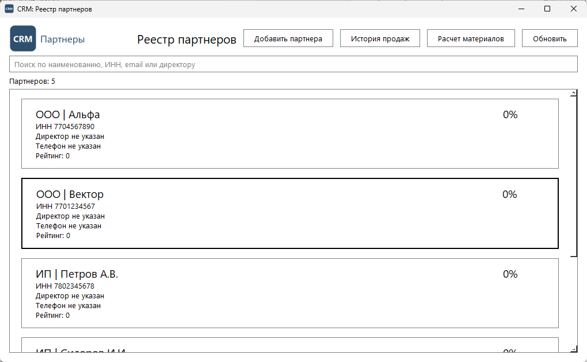
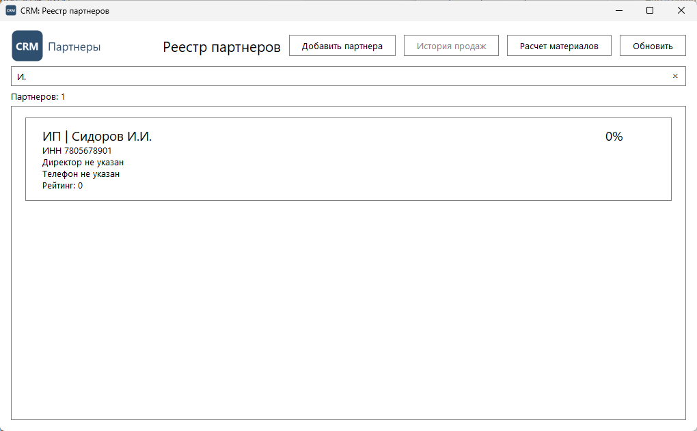
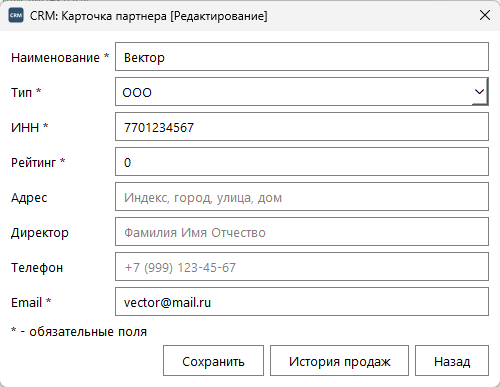
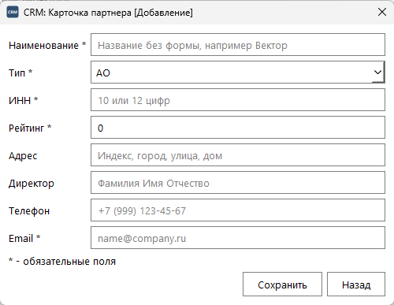
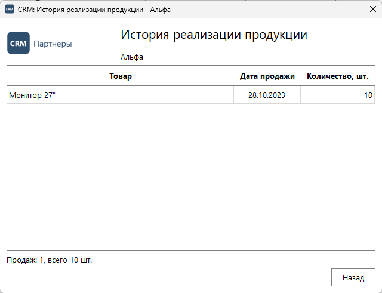
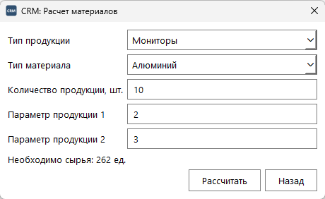

# Задание 3. Разработка UI, навигации и CRUD-форм

PySide6. Запуск из папки практики:

```
$env:PGPASSWORD = "пароль"
python "Разработка UI, навигации и CRUD-форм/main.py"
```

| Файл | Назначение |
|---|---|
| `main.py` | точка входа |
| `main_window.py` | `MainWindow`: реестр партнеров с поиском |
| `partner_edit_window.py` | `PartnerEditWindow`: добавление и редактирование |
| `partner_history_window.py` | `PartnerHistoryWindow`: история продаж |
| `material_calculator_window.py` | окно расчета сырья |
| `validation.py` | проверка полей карточки |
| `ui_common.py` | оформление, иконка, логотип |
| `resources/` | иконка приложения и логотип |
| `test_*.py` | тесты окон и проверки полей |

## Главная форма

Реестр из базы: тип и наименование, скидка, ИНН, директор, телефон,
рейтинг. Иконка в заголовке окна, логотип слева сверху, заголовок
«CRM: Реестр партнеров». Поиск по наименованию, ИНН, email и директору идет
запросом к базе через 0,3 с после паузы в наборе.





## Карточка партнера

Поля: Наименование, Тип (выпадающий список из `partner_types`), ИНН,
Рейтинг, Адрес, Директор, Телефон, Email. ИНН добавлен к полям из задания:
в базе он NOT NULL UNIQUE, без него партнера не сохранить.

Подсказки: у каждого поля плейсхолдер с образцом. В рейтинг можно ввести
только цифры, в ИНН - до 12 цифр, в телефон - цифры, `+`, скобки, пробелы и
дефисы: остальное поле не принимает. Перед записью `validation.py` проверяет
поля сверху вниз и объясняет первую ошибку.





## История и навигация

Таблица продаж: товар, дата, количество, новые сверху.



```
Реестр ── «Добавить партнера» ──────────> Карточка [Добавление]
       ── двойной щелчок по партнеру ───> Карточка [Редактирование] ── «История продаж» ──> История
       ── щелчок + «История продаж» ────> История
       ── «Расчет материалов» ──────────> Расчет
каждое окно ── «Назад» ──> окно, из которого открыто
```

Контекст не теряется: окна открываются модально поверх родителя, а
родитель не закрывается. После «Назад» в реестре остаются строка поиска,
выбранный партнер и прокрутка, а в карточке - несохраненный ввод, если в
историю ушли из нее. Между окнами передается только id партнера, каждое
окно читает по нему свежие данные из базы.



## Синхронизация

После «Сохранить» карточка пишет партнера в базу (INSERT или UPDATE по
наличию id) и шлет сигнал `saved`. Реестр на него перечитывает список из
базы с тем же поиском и выбором: новый или измененный партнер виден сразу,
без кнопки «Обновить».
